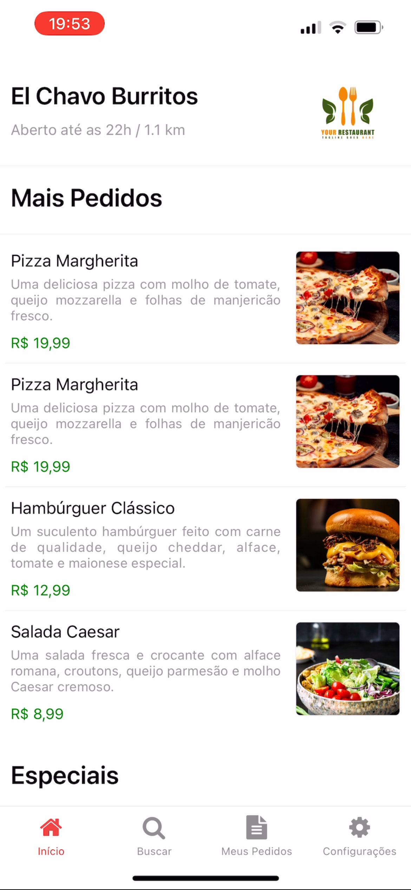
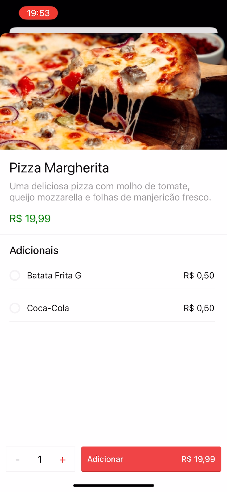
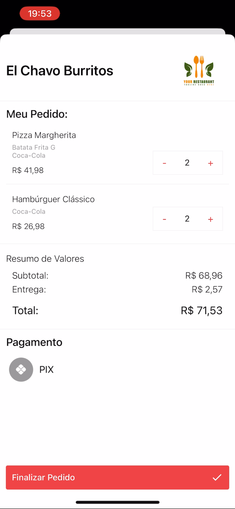
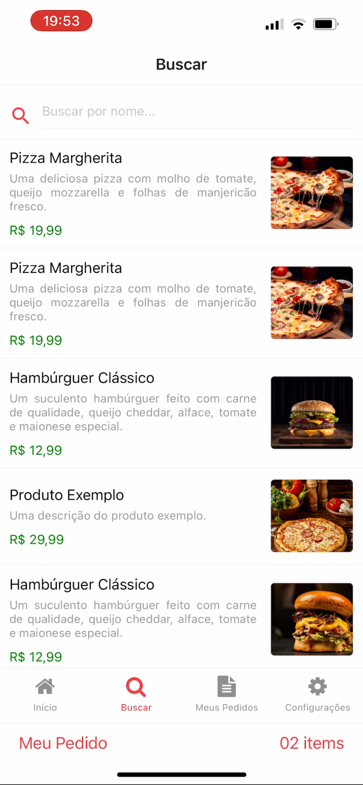

# AppDelivery

O **App de delivery** é uma plataforma de código aberto que permite a personalização completa com a marca e identidade visual do seu restaurante. Similar aquele outro app, possibilita que restaurantes estabeleçam um canal de vendas diretas, eliminando intermediários e proporcionando uma experiência de compra mais próxima aos usuários. Isso não apenas reduz custos desnecessários, mas também simplifica a gestão do estabelecimento.

_Fique a vontade para Criar, Modificar, Comercializar e Distribuir!_ <br/>
_Contribuições são sempre bem-vindas!_

#### Imagens

</img>
</img>
</img>
</img>

#### Videos

<a href="./Arquitetura/video1.mp4">Video - Utilizando o App</a>

## Principais Características

- **Personalização Total:** Coloque sua marca e identidade visual no sistema, transformando-o em uma extensão exclusiva do seu restaurante.
- **Vendas Diretas:** Elimine intermediários e suas taxas, oferecendo aos clientes uma experiência de compra mais acessível.

- **Gestão Simplificada:** Mantenha e simplifique a gestão do estabelecimento com a facilidade de operar o sistema.

- **Uso Próprio de Entregadores:** O sistema não gerencia a entrega, permitindo o uso de entregadores próprios para garantir uma experiência de entrega de alta qualidade.

- **Arquitetura Eficiente:** O servidor foi projetado para suportar um ou mais aplicativos simultaneamente, permitindo a divisão de custos e manutenção simplificada em larga escala.

## Técnico

Um servidor tem a capacidade de executar simultaneamente _N_ aplicativos. Dessa forma, torna-se viável reduzir os custos do servidor, necessitando apenas de um servidor para sustentar toda a infraestrutura de aplicativos.

### Arquitetura:


_Uma arquitetura baseada em microserviços_

### Frontend:

- Desenvolvido em React Native e Expo, possibilitando a publicação na App Store e Google Play.
- Utiliza o Expo para construção gratuita na nuvem, dispensando a necessidade de um computador ou MacBook, especialmente para iOS.

### Backend:

- Arquitetura baseada em microsserviços, permitindo a adição de novos serviços na linguagem desejada.
- Utiliza Golang devido à sua performance e baixo consumo de recursos.
- Implementado em Docker, facilitando a inicialização do servidor sem exigir amplo conhecimento técnico.

## Como Rodar

### Backend:

_É importante já ter o docker instalado no sistema operacional._

Rode no terminal:

```bash
docker compose up
```

As credenciais de banco estão presentes no docker-compose.yml.
<br/>
_Para fazer o deploy é só seguir os passos que o <a href="/Backend/docker-compose.yml">docker-compose.yml</a> faz._

#### Rodar um serviço em especifico:

Para rodar os microserviços separadamente você precisa já ter o GoLang instalado em sua maquina, acessar a pasta do microsserviço pelo terminal e utilizar:

```bash
go mod tidy
go install
```

Para rodar:

```bash
go run main.go
```

### Frontend:

Tenha o node instalado na sua maquina, no caso eu utilizei a v16.15. na pasta _Frontend/services/api.tsx_ faça alterações para apontar o backend que você subiu. Utilizando Ipconfig/Ifconfig é só pegar o endereço de IP da maquina juntamente com a prota que está rodando aplicativo e alterar a url.

Instalando dependências.

```bash
npm install
```

Para rodar:

```bash
npm start
```

_Baixe o App do EXPO, no seu celular, pela loja de aplicativos e esteja conectado na mesma rede que o seu computador, o aplicativo será visto por toda rede interna enquando estiver em desenvolvimento._

## Configuração do Estabelecimento

Tendo postman na sua maquina, é só importar a biblioteca de requests presentes na pasta _Backend/docs/delivery.postman_collection.json_ no qual você terá acesso a uma mini documentação dos endpoints e formatos esperados pela API.

#### Cadastrar Estabelecimento:

- Auth / Create User & Establishment
- Product & Order / Delivery / Alter Taxe Delivery
- Product & Order / Products / Create Multi Products
- Product & Order / Additional / Create Additional
- Product & Order / Additional / Vinculo Additional Products

#### Geraração de Aplicativo:

- No arquivo <a href="Frontend/config/config.tsx">_Frontend/config/config.tsx_</a>, na propriedade _ESTABLISHMENT_, modifique o objeto com as informações desejadas, incluindo logotipos e coordenadas geográficas do estabelecimento (para cálculos de distância).
- No mesmo arquivo, <a href="Frontend/config/config.tsx">_Frontend/config/config.tsx_</a>, atualize a propriedade _ESTABLISHMENT_ID_ com o identificador gerado durante o cadastro do estabelecimento _(REQUEST: Auth / Create User & Establishment)_.
