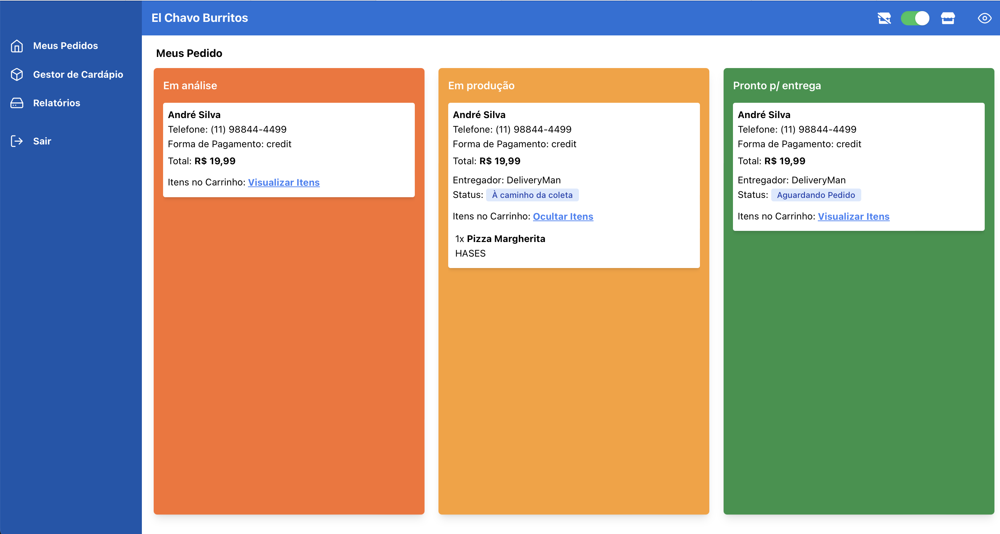
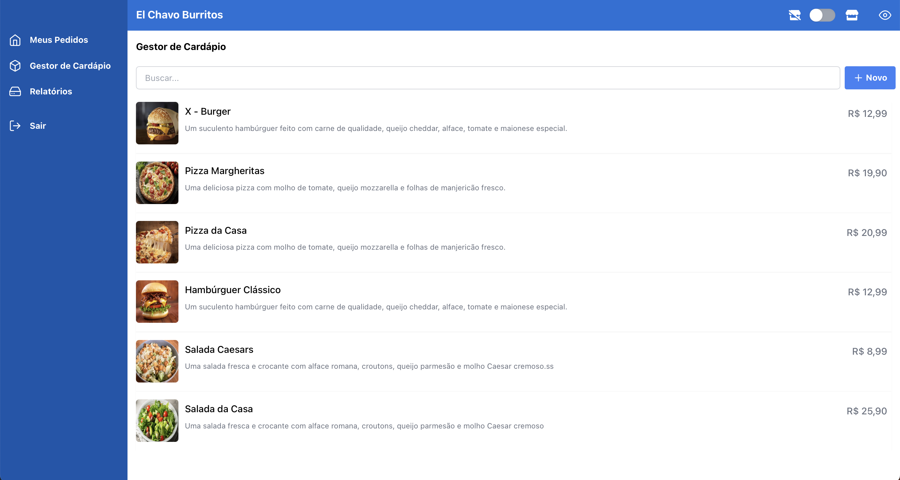
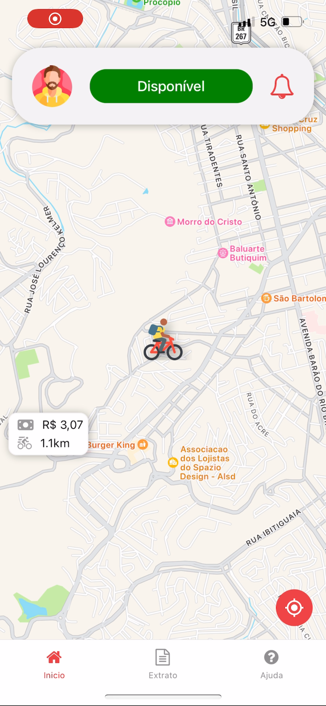
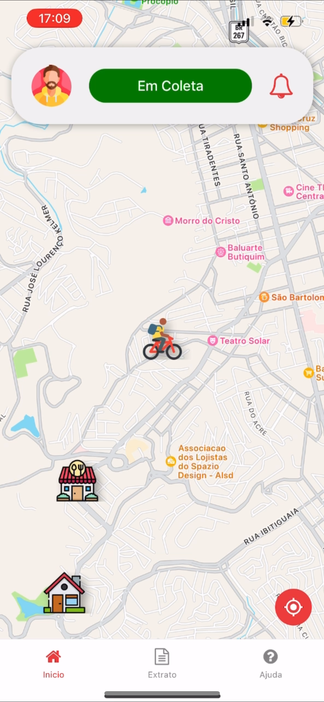
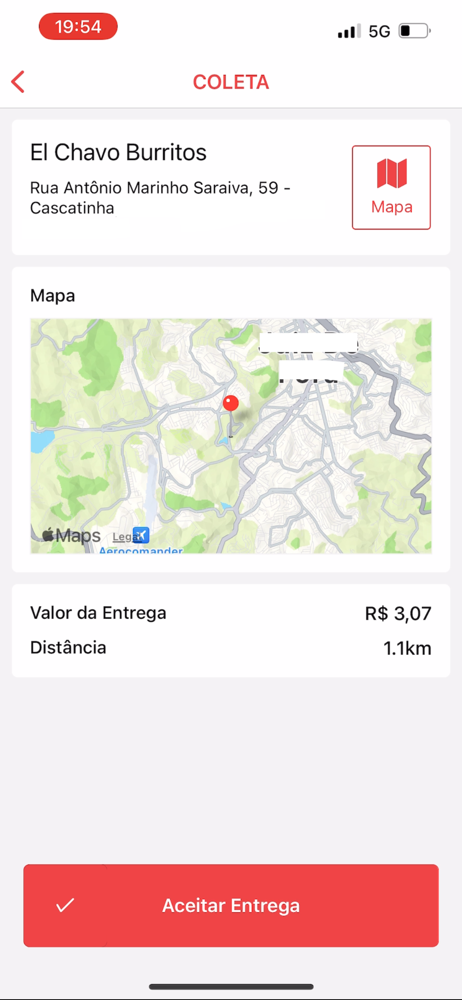
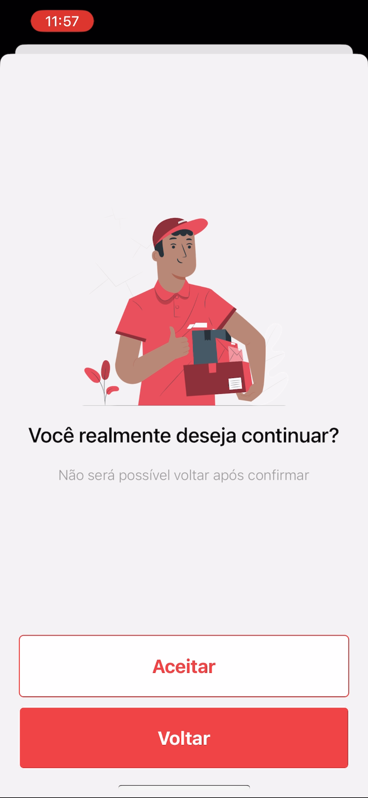

# Delivery

O **Delivery** é uma plataforma de código aberto que permite a personalização completa com a marca e identidade visual do seu restaurante ou mais restaurantes. Similar aos principais apps do mercado, possibilita que restaurantes estabeleçam um canal de vendas diretas, eliminando intermediários e proporcionando uma experiência de compra mais próxima aos usuários. Isso não apenas reduz custos desnecessários, mas também simplifica a gestão do estabelecimento.

_Fique a vontade para Adicionar, Modificar, Comercializar e Distribuir!_ <br/>
_Contribuições são sempre bem-vindas!_

##### <a href="https://github.com/carloshomar/appdelivery/issues">Backlog e Andamento do Projeto</a>

#### App de Comida

</img>
</img>
</img>
</img>

#### Videos

<a href="./Arquitetura/video1.mp4">Video - Utilizando o App de Comida</a>

#### Web Restaurante

</img>
_Kanban de fluxo de trabalho do restaurante._

#### Gestor de Cardápio

</img>
_Gestor de cardápio para criação e alteração de produtos._

#### App de Entregas:

</img>
</img>
</img>
</img>

## Principais Características

- **Modos de estabelecimentos**: Existe o modo **unique** que deixa o app focado em um estabelecimento e também o modo **multi** que lista os estabelecimentos presentes no servidor, no <a href="Frontend/AppComida/config/config.tsx">arquivo de configurações</a> você pode selecionar o estilo desejado.

- **Personalização Total:** Coloque sua marca e identidade visual no sistema, transformando-o em uma extensão exclusiva do seu restaurante.
- **Vendas Diretas:** Elimine intermediários e suas taxas, oferecendo aos clientes uma experiência de compra mais acessível.

- **Gestão Simplificada:** Mantenha e simplifique a gestão do estabelecimento com a facilidade de operar o sistema.

- **Uso Próprio de Entregadores:** O sistema não gerencia a entrega, permitindo o uso de entregadores próprios para garantir uma experiência de entrega de alta qualidade.

- **Arquitetura Eficiente:** O servidor foi projetado para suportar um ou mais aplicativos simultaneamente, permitindo a divisão de custos e manutenção simplificada em larga escala.

## Técnico

Um servidor tem a capacidade de executar simultaneamente _N_ aplicativos. Dessa forma, torna-se viável reduzir os custos do servidor, necessitando apenas de um servidor para sustentar toda a infraestrutura de aplicativos.

### Arquitetura:


_Uma arquitetura baseada em microserviços_

### Back-end / Infra:

- Arquitetura baseada em microsserviços, permitindo a adição de novos serviços na linguagem desejada.
- Utiliza GoLang devido à sua performance e baixo consumo de recursos.
- O GoLang utiliza também o Fiber como framework API.
- Implementado em Docker, facilitando a inicialização do servidor sem exigir amplo conhecimento técnico.

### App Entregas:

- Desenvolvido em React Native e Expo, possibilitando a publicação na App Store e Google Play.
- Utiliza o Expo para construção gratuita na nuvem, dispensando a necessidade de um computador ou MacBook, especialmente para iOS.

### App Comida:

- Quando o pedido é feito pelo app de comida e aprovado pelo estabelecimento, ele é publicada na fila indicada na variavel de ambiente: `RABBIT_DELIVERY_QUEUE`.

## Como Rodar

### Backend:

_É importante já ter o docker instalado no sistema operacional._

Rode no terminal:

```bash
docker compose up --build
```

As credenciais de banco estão presentes no docker-compose.yml.
<br/>
_Para fazer o deploy é só seguir os passos que o <a href="/Backend/docker-compose.yml">docker-compose.yml</a> faz._

#### Rodar um serviço em especifico:

Para rodar os microserviços separadamente você precisa já ter o GoLang instalado em sua maquina, acessar a pasta do microsserviço pelo terminal e utilizar:

```bash
go mod tidy
go install
```

Para rodar:

```bash
go run main.go
```

### Frontend:

_Tenha o node instalado na sua maquina, no caso eu utilizei a v20.13.1_

No arquivo <a href="Frontend/AppComida/services/api.tsx">_Frontend/AppComida/services/api.tsx_</a> faça alterações da URL para apontar o backend que você subiu. Utilizando Ipconfig/Ifconfig é só pegar o endereço de IP da maquina juntamente com a porta que está rodando aplicativo e alterar a url.


_O processo de alteração de URL deve ser realizado nas 3 aplicações, WEBRestaurante, AppComida, AppEntregas._


<b>_Na parte WEB, em caso de não conseguir logar ou estiver tendo erro de CORS, considere instalar uma <a href="https://chromewebstore.google.com/detail/allow-cors-access-control/lhobafahddgcelffkeicbaginigeejlf?hl=pt-BR">extenão que desabilita CORS no seu navegador</a>, ou inicialize o mesmo sem essa politica._</b>

Instalando dependências.

```bash
npm install
```

Para rodar:

```bash
npm start
```

_Baixe o App do EXPO, no seu celular, pela loja de aplicativos e esteja conectado na mesma rede que o seu computador, o aplicativo será visto por toda rede interna enquando estiver em desenvolvimento._

## Configuração do Estabelecimento

Tendo postman na sua maquina, é só importar a biblioteca de requests presentes na pasta _Backend/docs/delivery.postman_collection.json_ no qual você terá acesso a uma mini documentação dos endpoints e formatos esperados pela API.

#### Configure o Modo:

No arquivo <a href="Frontend/AppComida/config/config.tsx">_Frontend/AppComida/config/config.tsx_</a> altere a variavel **APP_MODE** para **.unique** ou **.multi**.

- Unique: Para quando o app é voltado somente para 1 unico restaurante, neste caso ele consome da variavel estatica **ESTABLISHMENT**, também presente no arquivo.

- Multi: Para quando o app deve comportar todos os restaurantes cadastrados no servidor, e fornece a possibilidade do usuário selecionar o restaurante que bem deseja.

#### Cadastrar Estabelecimento:

- Auth / Create User & Establishment
- Product & Order / Delivery / Alter Taxe Delivery
- Product & Order / Products / Create Multi Products  <b>_(Pode ser feito pela aplicação WEBRestaurante)_</b>
- Product & Order / Additional / Create Additional  <b>_(Pode ser feito pela aplicação WEBRestaurante)_</b>
- Product & Order / Additional / Vinculo Additional Products  <b>_(Pode ser feito pela aplicação WEBRestaurante)_</b>

#### Calculo de Entrega:

- Cada restaurante tem seu próprio valor de entrega e distância de atendimento.
- O cálculo consiste em pôr um valor fixo (Taxa de Serviço) `fixedTaxa` e valor por KM `perKm`, em casos.
- Baseado na distância recebida, o app calcula a distância através do algoritmo de Haversine, envia para o backend e recebe o valor calculado de acordo com o estabelecimento.

#### Geraração de Aplicativo:

- No arquivo <a href="Frontend/AppComida/config/config.tsx">_Frontend/AppComida/config/config.tsx_</a>, na propriedade _ESTABLISHMENT_, modifique o objeto com as informações desejadas, incluindo logotipos e coordenadas geográficas do estabelecimento (para cálculos de distância).
- No mesmo arquivo, <a href="Frontend/AppComida/config/config.tsx">_Frontend/AppComida/config/config.tsx_</a>, atualize a propriedade _ESTABLISHMENT_ID_ com o identificador gerado durante o cadastro do estabelecimento _(REQUEST: Auth / Create User & Establishment)_.
